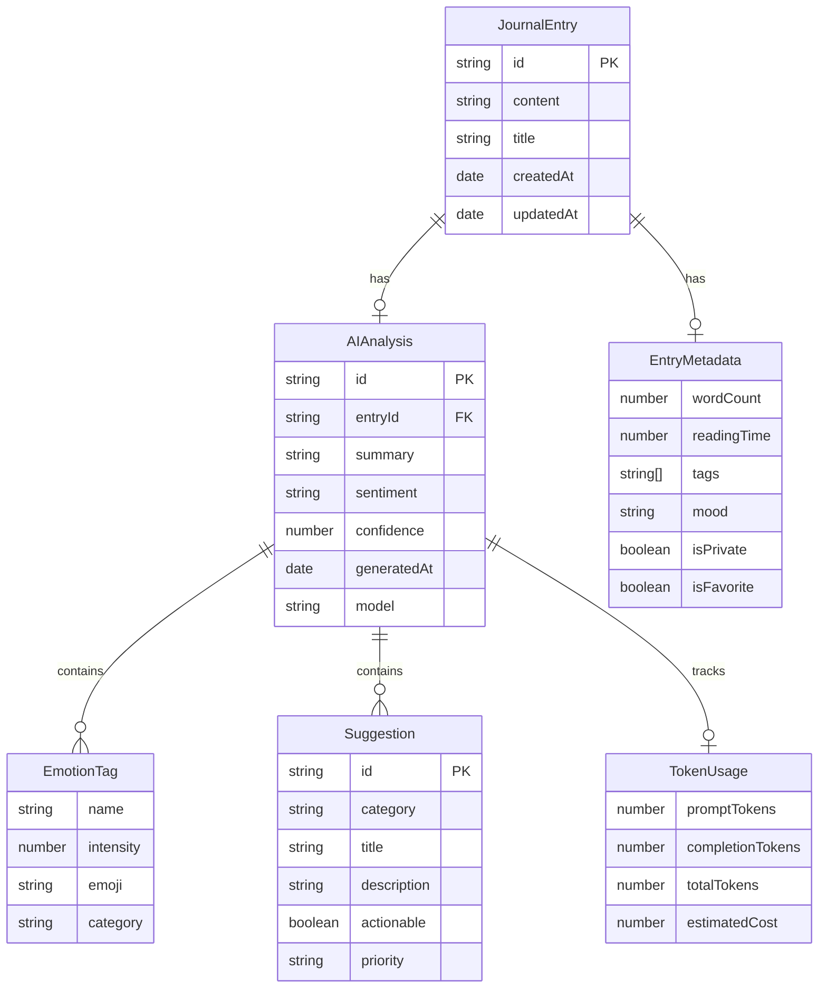

# Data Models

## Overview

This document defines the core data models and entities for the Insight Journal application. These models represent the business domain and serve as the foundation for all data operations, storage, and API interactions.

## Core Business Entities

### Journal Entry

**Purpose**: Represents a single journal entry created by the user, including the original content and any AI-generated analysis.

**Key Attributes**:
```typescript
interface JournalEntry {
  id: string;                    // Unique identifier (nanoid)
  content: string;               // User's journal content (Markdown)
  title?: string;                // Optional title (derived from first line or user-provided)
  createdAt: Date;               // Entry creation timestamp
  updatedAt: Date;               // Last modification timestamp
  aiAnalysis?: AIAnalysis;       // AI-generated insights (optional)
  metadata?: EntryMetadata;      // Additional metadata
}
```

**Relationships**:
- One-to-one with AIAnalysis (optional)
- One-to-one with EntryMetadata (optional)

**Business Rules**:
- ID must be unique across all entries
- Content cannot be empty
- CreatedAt is immutable after creation
- UpdatedAt changes on any modification
- AI analysis is generated asynchronously after entry creation

### AI Analysis

**Purpose**: Contains all AI-generated insights for a journal entry, including summary, emotions, and suggestions.

**Key Attributes**:
```typescript
interface AIAnalysis {
  id: string;                    // Unique analysis identifier
  entryId: string;               // Reference to parent journal entry
  summary: string;               // AI-generated summary
  sentiment: SentimentType;      // Overall sentiment analysis
  emotions: EmotionTag[];        // Detected emotions with intensity
  suggestions: Suggestion[];     // Personalized suggestions
  confidence: number;            // AI confidence score (0-1)
  generatedAt: Date;             // Analysis generation timestamp
  model: string;                 // AI model used (e.g., "gpt-3.5-turbo")
  tokenUsage?: TokenUsage;       // API usage statistics
}

type SentimentType = 'positive' | 'neutral' | 'negative';
```

**Relationships**:
- Belongs to one JournalEntry
- Contains multiple EmotionTags
- Contains multiple Suggestions

**Business Rules**:
- Analysis is immutable once generated
- Confidence score must be between 0 and 1
- At least one emotion tag must be present
- Summary cannot be empty

### Emotion Tag

**Purpose**: Represents a specific emotion detected in the journal entry with its intensity level.

**Key Attributes**:
```typescript
interface EmotionTag {
  name: string;                  // Emotion name (e.g., "joy", "anxiety")
  intensity: number;             // Intensity level (0-1 scale)
  emoji?: string;                // Optional emoji representation
  category?: EmotionCategory;    // Emotion category grouping
}

type EmotionCategory = 'positive' | 'negative' | 'neutral' | 'complex';

// Predefined emotion types
const EMOTION_TYPES = [
  'joy', 'sadness', 'anger', 'fear', 'surprise', 'disgust',
  'calm', 'anxiety', 'excitement', 'contentment', 'frustration',
  'hope', 'gratitude', 'loneliness', 'confidence', 'stress'
] as const;
```

**Relationships**:
- Belongs to one AIAnalysis
- References predefined emotion types

**Business Rules**:
- Intensity must be between 0 and 1
- Emotion name must be from predefined list
- Each emotion can appear only once per analysis

### Suggestion

**Purpose**: Represents an AI-generated personalized suggestion for the user based on their journal content and emotional state.

**Key Attributes**:
```typescript
interface Suggestion {
  id: string;                    // Unique suggestion identifier
  category: SuggestionCategory;  // Suggestion type/category
  title: string;                 // Brief suggestion title
  description: string;           // Detailed suggestion content
  actionable: boolean;           // Whether suggestion includes specific actions
  priority: PriorityLevel;       // Suggestion priority
  tags?: string[];               // Optional categorization tags
}

type SuggestionCategory = 
  | 'wellness' 
  | 'mindfulness' 
  | 'productivity' 
  | 'reflection' 
  | 'social' 
  | 'physical';

type PriorityLevel = 'low' | 'medium' | 'high';
```

**Relationships**:
- Belongs to one AIAnalysis
- Can be grouped by category

**Business Rules**:
- Title and description cannot be empty
- Priority must be specified
- Actionable suggestions should include specific steps

## Supporting Data Models

### Entry Metadata

**Purpose**: Additional metadata for journal entries, including user preferences and system information.

**Key Attributes**:
```typescript
interface EntryMetadata {
  wordCount: number;             // Calculated word count
  readingTime: number;           // Estimated reading time (minutes)
  tags?: string[];               // User-defined tags
  mood?: UserMood;               // User-reported mood (optional)
  location?: string;             // Optional location information
  weather?: string;              // Optional weather information
  isPrivate: boolean;            // Privacy setting
  isFavorite: boolean;           // User favorite flag
}

type UserMood = 'great' | 'good' | 'okay' | 'bad' | 'terrible';
```

### Token Usage

**Purpose**: Tracks OpenAI API token consumption for cost monitoring and optimization.

**Key Attributes**:
```typescript
interface TokenUsage {
  promptTokens: number;          // Tokens used in prompt
  completionTokens: number;      // Tokens used in completion
  totalTokens: number;           // Total tokens consumed
  estimatedCost?: number;        // Estimated cost in USD
}
```

### Storage Data Structure

**Purpose**: Defines how data is stored in localStorage with versioning for future migrations.

**Key Attributes**:
```typescript
interface StorageData {
  version: string;               // Data format version
  entries: JournalEntry[];       // Array of journal entries
  settings?: UserSettings;       // User preferences
  lastSync?: Date;               // Last synchronization timestamp
}

interface UserSettings {
  theme: 'light' | 'dark' | 'system';
  language: string;
  autoSave: boolean;
  aiAnalysisEnabled: boolean;
  defaultPrivacy: boolean;
}
```

## Data Validation Rules

### Journal Entry Validation
```typescript
const journalEntrySchema = {
  id: { required: true, type: 'string', minLength: 1 },
  content: { required: true, type: 'string', minLength: 1 },
  title: { required: false, type: 'string', maxLength: 200 },
  createdAt: { required: true, type: 'date' },
  updatedAt: { required: true, type: 'date' }
};
```

### AI Analysis Validation
```typescript
const aiAnalysisSchema = {
  summary: { required: true, type: 'string', minLength: 10, maxLength: 500 },
  sentiment: { required: true, enum: ['positive', 'neutral', 'negative'] },
  emotions: { required: true, type: 'array', minItems: 1, maxItems: 10 },
  confidence: { required: true, type: 'number', min: 0, max: 1 }
};
```

## Data Relationships Diagram



## Migration Strategy

### Version 1.0 → 2.0 Migration
When moving from localStorage to cloud storage:

1. **Data Export**: Export all localStorage data to JSON
2. **Schema Validation**: Validate against new schema
3. **Data Transformation**: Convert to cloud-compatible format
4. **Incremental Sync**: Upload data in batches
5. **Verification**: Verify data integrity after migration

### Backward Compatibility
- Maintain support for previous data formats
- Graceful degradation for missing fields
- Clear migration paths for breaking changes

---

**Last Updated**: 2025-07-22  
**Schema Version**: 1.0  
**Next Review**: Before cloud storage implementation
