# High-Level Architecture

## Technical Summary

The Insight Journal system employs a **Serverless + Component-Based Frontend Architecture**. It leverages Next.js for hybrid rendering capabilities (SSR/SSG) and Vercel's Serverless Functions for API routes, particularly for integrating with the OpenAI API. The frontend is built with a modular, component-based approach using React, organized with Feature-Sliced Design. Data persistence for the MVP uses browser localStorage, with a clear strategy for future migration to cloud storage. This architecture prioritizes rapid development, scalability for future features, and a responsive user experience as outlined in the PRD.

## High-Level Overview

### Main Architectural Style
**Serverless + Component-Based Frontend Architecture**

We use Next.js App Router for a hybrid of Server-Side Rendering (SSR) and Static Site Generation (SSG). Vercel's Serverless Functions handle API routes, and the frontend utilizes a component-based structure with React.

### Repository Structure Decision
**Polyrepo** - As per the PRD, this allows for clear separation between the Next.js web application (frontend) and potential future backend APIs, providing flexibility for microservice expansion later.

### Service Architecture Decision
**Monolith (Frontend Application)** for the MVP. The initial version is a self-contained frontend web application using localStorage for data persistence and integrating with external services (like OpenAI) via Next.js API Routes. This simplifies initial deployment and development.

### Primary User Interaction Flow

```
User visits home page → 
navigates to journal page → 
writes journal content → 
saves to localStorage → 
triggers AI analysis → 
calls OpenAI API via Next.js API Route → 
generates summary/sentiment/suggestions → 
displays AI results → 
saves complete data (including AI analysis) to localStorage
```

### Data Flow

- **Input**: User journal text
- **Processing**: Next.js Application (Client & Server Components) → Next.js API Routes → OpenAI API
- **Storage**: Browser localStorage (MVP) / Cloud Storage (Future, e.g., Supabase)
- **Output**: AI-enhanced journal entries (summary, emotion tags, suggestions)

### Key Architectural Decisions and Rationale

1. **Next.js + Vercel Deployment**
   - Chosen for out-of-the-box SSR/SSG support
   - Excellent developer experience
   - Seamless integration with Vercel's optimized hosting and serverless functions

2. **localStorage as MVP Data Storage**
   - Selected for zero configuration and rapid prototyping
   - Avoids initial backend infrastructure complexity
   - Acknowledged limitations: single-device, ~5-10MB storage capacity

3. **Tailwind CSS + Framer Motion**
   - Rapid UI development and consistent design system
   - Achieving fluid animations for enhanced UX

4. **Zustand State Management**
   - Lightweight nature and TypeScript friendliness
   - Simplicity compared to more complex alternatives

5. **API Routes for OpenAI Integration**
   - Protects API keys on server-side
   - Handles server-side processing
   - Manages error handling and rate limiting for external API calls

6. **Component-based and Modular Design**
   - Promotes code reusability and testability
   - Facilitates team collaboration and AI-driven development

## High-Level Project Diagram

```mermaid
graph TB
  %% User Entry Points
  User[("👤 User<br/>(Browser)")]

  %% System Boundary
  subgraph "Insight Journal System"
      %% Frontend Layer
      subgraph "Frontend (Next.js App)"
          HomePage["🏠 Home Page<br/>(/)"]
          JournalPage["📝 Journal Page<br/>(/journal)"]

          subgraph "UI Components"
              Editor["✏️ Markdown Editor<br/>Component"]
              EntryList["📋 Entry List<br/>Component"]
              AIResults["🤖 AI Results<br/>Component"]
          end

          subgraph "State Management"
              Zustand["📦 Zustand Store<br/>(Global State)"]
          end
      end

      %% API Layer
      subgraph "API Routes (Serverless)"
          AIRoute["/api/ai/analyze<br/>API Route"]
          ConfigRoute["/api/config<br/>API Route"]
      end

      %% Storage Layer
      LocalStorage[("💾 localStorage<br/>(Browser Storage)")]
  end

  %% External Services
  subgraph "External Services"
      OpenAI["🧠 OpenAI API<br/>(GPT-3.5/4)"]
      Vercel["☁️ Vercel<br/>(Hosting/CDN)"]
  end

  %% Future Services (Dashed)
  subgraph "Future Services"
      CloudDB[("☁️ Cloud Database<br/>(Firebase/Supabase)")]
      Auth["🔐 Auth Service<br/>(NextAuth.js)"]
  end

  %% Data Flow - User Interactions
  User -->|"Visits Site"| HomePage
  User -->|"Navigates"| JournalPage
  User -->|"Writes Entry"| Editor

  %% Data Flow - Internal
  Editor -->|"Save Entry"| Zustand
  Zustand -->|"Persist"| LocalStorage
  EntryList -->|"Load Entries"| LocalStorage

  %% AI Processing Flow
  Editor -->|"Analyze"| AIRoute
  AIRoute -->|"API Key"| ConfigRoute
  AIRoute -->|"Process Text"| OpenAI
  OpenAI -->|"Summary<br/>Emotions<br/>Suggestions"| AIRoute
  AIRoute -->|"Results"| AIResults
  AIResults -->|"Display"| JournalPage
  AIResults -->|"Save"| Zustand

  %% Deployment
  Vercel -->|"Serves"| HomePage
  Vercel -->|"Serves"| JournalPage
  Vercel -->|"Hosts"| AIRoute

  %% Future Connections (Dashed)
  Zustand -.->|"Future: Sync"| CloudDB
  User -.->|"Future: Login"| Auth
  Auth -.->|"Future: Authenticate"| CloudDB

  %% Styling
  classDef userStyle fill:#e1f5fe,stroke:#01579b,stroke-width:3px
  classDef frontendStyle fill:#f3e5f5,stroke:#4a148c,stroke-width:2px
  classDef apiStyle fill:#fff3e0,stroke:#e65100,stroke-width:2px
  classDef storageStyle fill:#e8f5e9,stroke:#1b5e20,stroke-width:2px
  classDef externalStyle fill:#fce4ec,stroke:#880e4f,stroke-width:2px
  classDef futureStyle fill:#f5f5f5,stroke:#616161,stroke-width:2px,stroke-dasharray: 5 5

  class User userStyle
  class HomePage,JournalPage,Editor,EntryList,AIResults,Zustand frontendStyle
  class AIRoute,ConfigRoute apiStyle
  class LocalStorage storageStyle
  class OpenAI,Vercel externalStyle
  class CloudDB,Auth futureStyle
```



## Architectural and Design Patterns

### Architectural Style Pattern
**Serverless + Component-Based Frontend Architecture** with Next.js App Router for hybrid rendering.

**Rationale**: Leverages Next.js for efficient frontend development, SSR/SSG capabilities, and Vercel's Serverless Functions for API routes. The App Router's support for React Server Components is a modern advantage. The component-based approach directly supports the PRD's "light animations" and "responsive design" requirements, ensuring modularity and reusability on the frontend.

### Code Organization Pattern
**Feature-Sliced Design / Domain-Driven Design** (simplified)

**Rationale**: Organizing code by feature or domain enhances modularity, maintainability, and scalability. The proposed structure: `src/features/`, `src/shared/`, `src/entities/`, and `src/app/` adheres to this, aligning with the PRD's modularity requirements and facilitating team collaboration.

### Data Pattern (MVP)
**Client-Side Persistence** using localStorage with a clear migration path to Cloud Storage.

**Rationale**: Directly supports the MVP goal of zero backend infrastructure and rapid prototyping. Implemented using Zustand's persist middleware for automatic synchronization and planning for future data migration interfaces and version control for compatibility when moving to cloud solutions like Supabase.

### Communication Pattern (AI Integration)
**RESTful API** via Next.js API Routes.

**Rationale**: The most straightforward and idiomatic approach for integrating with OpenAI from a Next.js application. It allows protection of API keys on the server-side, handles errors, and manages rate limits. Request queue management, response caching, and streaming responses will be considered.

### State Management Pattern
**Zustand with Immer**

**Rationale**: Zustand is lightweight and TypeScript-friendly. Combining it with Immer simplifies complex immutable state updates, leading to more readable and maintainable code, especially for nested data structures like journal entries with AI analysis results.

### Error Handling Pattern
**Error Boundary + Custom Error Pages**

**Rationale**: React Error Boundaries gracefully catch JavaScript errors, providing fallback UI. Coupled with custom error pages for routing-level errors (app/error.tsx for runtime, app/not-found.tsx for 404), this provides a robust and user-friendly error recovery mechanism with friendly error prompts, specifically handling OpenAI API call failures.

### UI Pattern
**Compound Components + Render Props**

**Rationale**: Promotes highly reusable and flexible UI components. Compound Components allow implicit sharing of state and logic (e.g., JournalEditor). Render Props enable sharing code between React components using a function prop, enhancing reusability and dynamic interactions (e.g., AIAnalysisProvider).

## Scalability Considerations

### Current MVP Limitations
- **Single Device**: localStorage is browser/device specific
- **Storage Capacity**: ~5-10MB limit for localStorage
- **No Real-time Sync**: No collaboration features
- **No Authentication**: No user accounts or data protection

### Future Scalability Path
1. **Phase 2**: Add cloud storage (Supabase/Firebase)
2. **Phase 3**: Implement user authentication
3. **Phase 4**: Add real-time collaboration features
4. **Phase 5**: Mobile application development

### Performance Optimization Strategy
- **Code Splitting**: Automatic with Next.js
- **Image Optimization**: Next.js Image component
- **API Caching**: Vercel Edge caching
- **Bundle Analysis**: Regular monitoring with @next/bundle-analyzer

---

**Last Updated**: 2025-07-22  
**Next Review**: Before Epic 2 implementation  
**Owner**: Architecture Team
